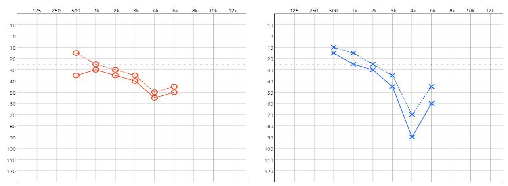
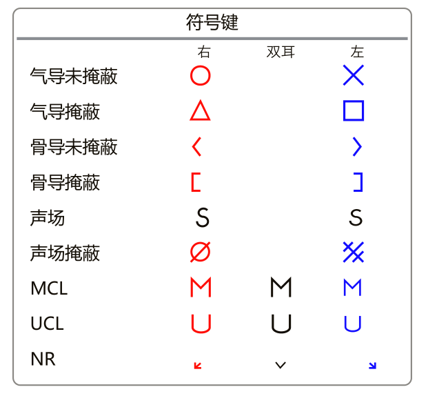
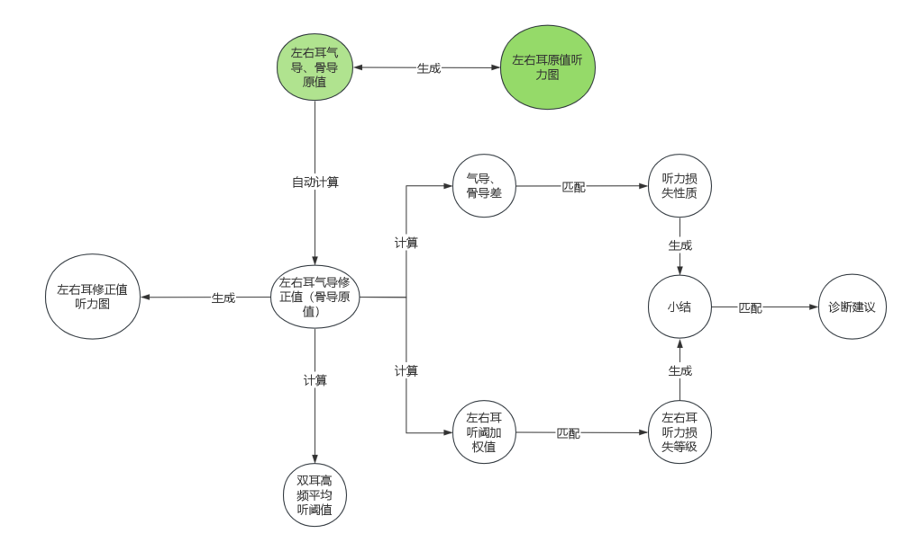
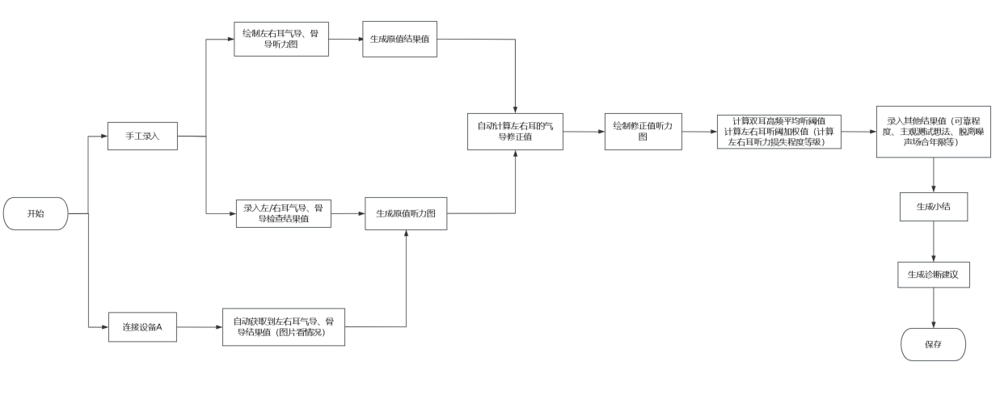

# electro-audiogram 简介
电测听力图是由分贝值与频率数据矩阵构成的平面坐标图，由于频率值的统计是一个非连续性的过程，而每组频率和分贝数据需要与听力标记建立映射关系，因此需要构建一个适用于电测听力图的非标准平面坐标系，市面上如Echarts的数据可视化工具无法灵活、准确的描述听力数据变化情况，因此electro-audiogram就是用来解决这个问题的工具库，基于此用canvas重新绘制可视化的听力数据描述。

## 用法
```bash
npm i electro-audiogram -S
```

```javascript
import ElectroAudiogram from 'electro-audiogram'

// 每次实例化指定一侧耳朵方向
const leftElectroAudiogram = new ElectroAudiogram({
    mountedEl: HTMLCanvasElement,
    earDirection: 'LEFT',
});

const rightElectroAudiogram = new ElectroAudiogram({
    mountedEl: HTMLCanvasElement,
    earDirection: 'RIGHT',
});

// 当听力数据变化时，调用render则以参数中新数据重新渲染canvas
leftElectroAudiogram.render([
    {
        frequency: 125,
        decibel: 25,
        conductionType: 'BC',
        earDirection: 'RIGHT',
        status: 'COVERED',
    },
    {
        frequency: 250,
        decibel: 65,
        conductionType: 'BC',
        earDirection: 'RIGHT',
        status: 'UNCOVERED',
    },
    {
        frequency: 125,
        decibel: 25,
        conductionType: 'AC',
        earDirection: 'RIGHT',
        status: 'COVERED',
    },
    {
        frequency: 250,
        decibel: 65,
        conductionType: 'AC',
        earDirection: 'RIGHT',
        status: 'UNCOVERED',
    }
]);
```
详细类型参见类型声明
```typescript
// 听力数据类型
type AudiogramData = {
    /**
     * 频率 (Hz)
     */
    frequency: FrequencyValues;
    /**
     * 分贝 (dB)
     */  
    decibel: DecibelValues;
    /**
     * 传导类型，AC气导，BC骨导
     */  
    conductionType: 'AC' | 'BC';
    /**
     * 状态
     */  
    status: PointStatus;
}
```
## 参考资料
**《GBZ49-2014职业性噪声聋的诊断》**<br />
**《GB/T 16403声学 测听方法纯音气导和骨导听阈基本测听法》**

## 标准设定
+ 人的听阈范围在0-20000Hz以内，在日常生活中，主要在0-10000Hz内，其中**125、250、500、1000、2000、3000、4000、6000、8000、10000、12000**这11个频率基本能反应人们的听力状况。
+ 通过气导耳机和骨导振子传声，由此判断人耳在各个频率上恰好能听到的最轻的声音（听阈），绘制成曲线图，在特殊情况下，增加骨导测试进行辅助测试。有时候为单耳测试的准确性（两只耳朵测量值相差较大时），会对另一只耳朵进行掩蔽。**每次以5dB为一档**逐步加大测试音直至得出反应。

## 通过测量的气导、骨导值绘制听力图
常规情况下：<br />
**右耳在前、左耳在后<br />
右耳红色、左耳蓝色<br />
气导实线、骨导虚线**


## 听力图符号键
气导、骨导、声场这几个的符号为常用符号，**其他符号根据医院设备情况略有不同。**


## 数据流程


## 业务流程
